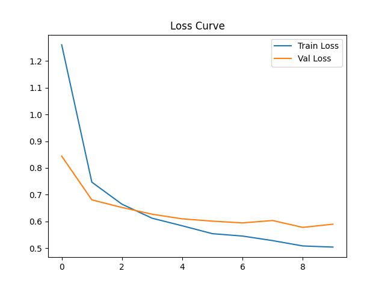
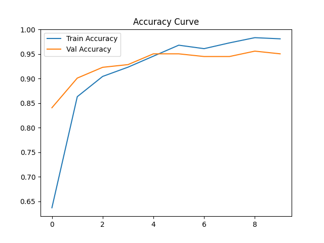

# Audio Classification Project

This project classifies audio samples using spectrogram images. The current milestone focuses on the dataset package and a runnable notebook that shows the model inputs and targets.

## Dataset

The repository includes a small example dataset under `data/example_data/` so the milestone notebook can run immediately after cloning the repo. The example dataset contains two spectrogram images per class:

- `Bass`
- `Hi Hat`
- `Kick`
- `Pad`
- `Snare`
- `Vocal`

Each example is a `.png` spectrogram. The data loader returns:

- input: a `torch.Tensor` image with shape `(3, 224, 224)`
- target: a `torch.long` integer label

The full dataset was curated by hand, combining many samples from personal libraries that I have, as well as utilizing samples from [Kaggle's Drum Kit Sound Samples Dataset](https://www.kaggle.com/datasets/anubhavchhabra/drum-kit-sound-samples?resource=download).

## Dataset Download

The full dataset is hosted in the latest GitHub release:

https://github.com/jurneebrinson/audio-classification-project/releases/tag/data

To ensure the project runs correctly, download and extract the dataset into the `data/` directory at the root of the repository. The code assumes this exact structure when loading training, validation, and test splits.

## Model Architecture

The project uses a custom CNN implemented in `audio_classification/models/cnn.py`.

Input spectrograms are resized to:

```text
(3, 224, 224)
```

The network learns visual patterns in spectrogram images, treating audio classification as an image classification problem.

## Results

### Test Performance

| Metric | Value |
|----------|----------|
| Test Accuracy | **92.47%** |

### Key Findings

- The model generalizes well to unseen audio samples, achieving over 92% accuracy on the test set.
- Kick, Pad, and Snare produced the strongest classification performance and highest F1-scores.
- Most classification errors occurred between Bass and Pad samples, suggesting overlapping frequency content and similar spectrogram structures.
- Misclassified examples often contained shorter audio segments or visually similar striped frequency patterns.

---

## Evaluation

Model evaluation is performed in:

```text
notebooks/evaluation.ipynb
```

The evaluation notebook includes:

- Test set inference
- Overall accuracy
- Classification report
- Confusion matrix
- Example predictions
- Misclassification analysis
- Visual inspection of incorrectly classified spectrograms

### Error Analysis

To better understand model behavior, misclassified spectrograms are visualized alongside:

- True label
- Predicted label

This qualitative analysis helps identify common failure modes and class confusion patterns.

---

## Training

The training pipeline:

1. Loads spectrogram images.
2. Applies preprocessing and batching.
3. Trains a CNN using PyTorch.
4. Tracks training and validation metrics.
5. Saves the best-performing model checkpoint.

The best model is automatically saved when validation accuracy improves.

Example checkpoint contents:

```python
{
    "epoch": best_epoch,
    "model_state_dict": model.state_dict(),
    "optimizer_state_dict": optimizer.state_dict(),
    "val_acc": val_acc,
    "val_loss": val_loss,
}
```

### Training Curves

During training, both loss and accuracy were tracked for the training and validation sets.

The plots below show the model’s learning behavior over time:

- Training and validation loss decrease steadily, indicating that the model is learning useful representations from the spectrograms.
- Validation loss stabilizes after several epochs, suggesting convergence.  The best validation loss of **0.578** was achieved at the ninth epoch of training.
- Training and validation accuracy increase together, with a small gap between them, indicating mild overfitting but overall good generalization.  The final best accuracies for training and validation sets were **98.3%** and **95.6%** respectively.

#### Loss Curve



#### Accuracy Curve



## Saved Outputs

Training artifacts are stored in:

```text
outputs/
├── logs/
│   └── training_history_20260603_141827.csv
├── models/
│   └── best_model.pth
└── plots/
    ├── acc_20260603_141827.png
    ├── loss_20260603_141827.png
    └── eval_confusion_matrix.png
```

### Included Artifacts

- Best model weights (`best_model.pth`)
- Training history logs
- Training accuracy curve
- Training loss curve
- Confusion matrix visualization


## Install

From the repository root:

```bash
python -m pip install -e .
```

## Run the Notebook

Open and run:

```bash
notebooks/data_demo.ipynb
```

The notebook loads `data/example_data`, prints the class mapping, fetches one sample, creates a batch with `torch.utils.data.DataLoader`, and visualizes example spectrograms.

## Future Improvements

Potential next steps include:

- Collecting additional training samples
- Applying stronger audio data augmentation
- Experimenting with deeper CNN architectures
- Exploring transfer learning approaches
- Investigating class-specific confusion between Bass and Pad samples
- Comparing CNN performance against transformer-based audio models

## Project Layout

```text
audio_classification/
  data/
    dataset.py       # PyTorch Dataset for spectrogram images
    dataloader.py    # DataLoader helper functions
  models/
    cnn.py           # Spectrogram CNN model architecture
  training/
    train.py         # Model training script
data/
  example_data/      # small milestone dataset included in the repo
notebooks/
  data_demo.ipynb    # runnable milestone data demo
  evaluation.ipynb   # Model evaluation and results
  test_model.ipynb   # Model testing
outputs/
  logs/
    training_history_20260603_141827.csv          # Training history
  models/
    best_model.pth   # Saved weights for the best model
  plots/
    acc_20260603_141827.png       # Training accuracy plot
    eval_confusion_matrix.png     # Evaluation confusion matrix
    loss_20260603_141827.png      # Training loss plot
scripts/
  split.py           # dataset split utility
```

## Author

**Jurnee Brinson**

University of Oregon  
DSCI 410L — Intro to Deep Learning Project
